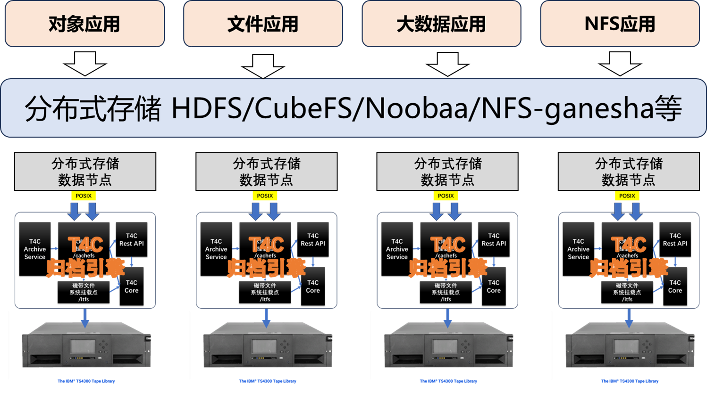
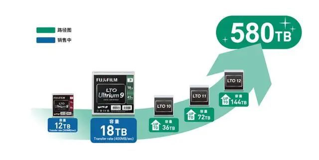
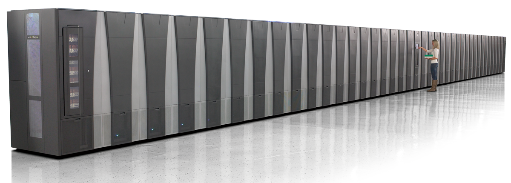
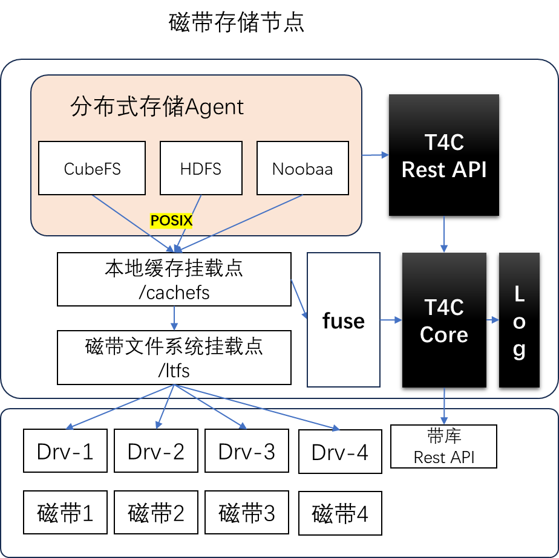

# 分布式存储磁带归档
    随着5G、物联网、多模态大模型的发展，企业产生了海量的数据，这些数据存储在各种分布式文件存储上，例如本文介绍的CubeFS。但是这些数据数量庞大，占用的众多的高性能服务器，消耗着大量的电力能源。本文试着结合低成本低能耗的磁带存储特点，构建一个低成本低功耗的CubeFS磁带归档存储系统。

    分布式存储系统使用磁带来存储冷数据，是行业发展的趋势，不管是国外的AWS、还是Azure，以及国内的腾讯、百度等，都大量的采用磁带来存储冷数据，优化了数据存储的成本，降低数据存储的功耗，实现绿色数据中心。 知乎上有一篇腾讯高级架构师分享的磁带存储案例：https://zhuanlan.zhihu.com/p/654202522。

## 分布式存储及挑战
    分布式存储技术自诞生以来，便以其独特的优势引领了数据存储领域的发展潮流。随着技术的不断进步，分布式存储系统已经能够高效地处理大规模数据集，为企业提供了强大的数据存储和处理能力。它通过将数据分散存储在多个节点上，不仅极大地提高了存储资源的利用率，还增强了系统的容错能力和负载均衡能力。如今，分布式存储已成为大数据、云计算和人工智能等领域不可或缺的技术支撑，其发展势头强劲，正推动着数据中心的变革和存储技术的创新。

    面对日益增长的海量数据，分布式存储技术虽然提供了有效的解决方案，但同时也面临着前所未有的挑战。首先，如何高效地管理、存储和分析PB级甚至ZB级的数据，对分布式存储系统的性能和可扩展性提出了极高的要求。其次，海量数据带来的存储成本问题也不容忽视，如何在保证性能的同时降低存储成本，成为分布式存储技术需要攻克的难题。此外，数据的安全性和隐私保护也是一大挑战，在海量数据的环境下，如何确保数据不被泄露和滥用，对分布式存储系统的安全机制提出了更高的要求。因此，分布式存储技术在未来发展中，还需不断优化和升级，以应对海量数据带来的种种挑战。

    磁带作为一种传统的存储介质，虽然在速度上无法与硬盘或固态存储相比，但在帮助企业解决分布式存储中海量数据的问题方面，磁带依然有其独特的优势：
_ 高容量与低成本
_ 低功耗绿色节能
_ 长期数据保留
_ 安全性与稳定性

    分布式存储可以无缝集成磁带技术，企业可以在分布式存储系统中实现数据分层策略，将不经常访问的数据迁移到磁带存储。这样，热数据可以存储在快速的硬盘或固态存储上，而冷数据则存储在成本更低的磁带上。

    行业常见的分布式文件存储、HDFS大数据存储、分布式对象存储，诸如HDFS、CubeFS、Noobaa、Minio、Ganesha NFS等，都可以使用T4C归档引擎无缝集成磁带技术。

## 磁带介绍
    磁带是一项悠久的IT技术，自IBM 1952年发明磁带技术以来，磁带技术经过多次技术创新。目前主流的磁带技术是LTO联盟的LTO9磁带，以及IBM的TS1170 JF磁带，LTO9磁带可以提供18T非压缩容量，TS1170 JF可以提供惊人的50TB的容量。目前磁带产业联盟已经实现了580TB的技术原型。 

    磁带存储广泛的应用在数据备份和数据存储领域，尤其是一些重要的数据需要离线备份、空气隔离，保障数据的安全。 
    总的来说磁带存储具有如下的优势：
- ** 数据离线保存，抵御黑客攻击
- ** 数据存储成本低
- ** 低功耗、绿色数据存储
- ** 数据容易移动等

    磁带介质需要结合带库设备一起使用，根据客户的容量和性能需求，这些设备分入门级的带库存储、中端带库设备和高端带库设备。 入门级的带库存储一般一个驱动器和数盘磁带；中端带库一般十几个驱动器和一两千盘磁带；高端带库有上百个驱动器和几万盘磁带，如IBM的TS4500、昆腾的i6000、Spectra Logic的Spectra TFinity Series。

## 分布式存储集成

## 磁带归档架构
    T4C是一个功能强大的磁带归档引擎，整个引擎由缓存文件系统、归档内核、归档外部Rest API接口，以及分布式系统的统一运维监控平台，和数据流转作业调度引擎组成。 

    T4C拥有开发的接口，可以无缝对接基于POSIX的分布式存储系统，比如HDFS、CubeFS、Noobaa等。通过与T4C集成，可以实现HDFS等分布式存储的磁带归档功能，降低了整个CubeFS集群的存储成本、优化了企业存储的能耗。 分布式存储通过归档节点的缓存文件系统，实现数据流的对接，简化分布式存储使用磁带存储的过程。 T4C归档引擎在后端通过磁带介质的调度，加载磁带到带机中去，最后把数据复制到磁带介质上，同时记录元数据信息。 T4C通过操作系统的fuse功能来监控分布式存储对数据的访问，如果数据在磁带上，T4C自动加载磁带，复制回数据到磁盘上。

    T4C也提供丰富的Rest API接口，CubeFS等集成软件可以调用迁移召回API实现高效的数据落带召回操作；CubeFS也可以通过RestAPI来调用带库设备接口，监控带库设备加载卸载磁带的操作。 

## T4C 团队介绍
    T4C团队来自IBM中国开发实验室，团队成员拥有二十年的系统开发经验、磁带归档系统架构规划和落地经验，参与过国内外多个超大规模磁带存储系统的开发交付。
    微信联系方式：Tape4Cloud
