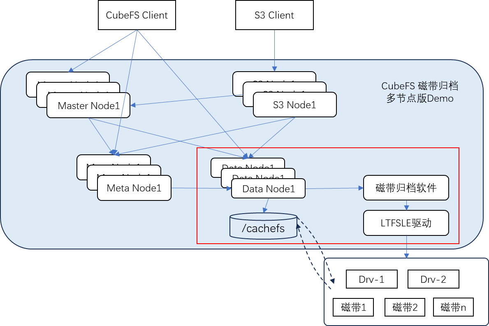

# CubeFS分布式存储和T4C归档集成的步骤

## CubeFS分布式存储架构
CubeFS归档节点安装CubeFS DataNode软件、缓存文件系统、T4C引擎、IBM LTFSLE驱动，

## 归档节点环境配置

## 归档节点LTFSLE驱动安装

## 归档节点T4C引擎安装和配置

## 归档节点CubeFS DataNode软件安装和配置

## 归档节点归档服务配置

