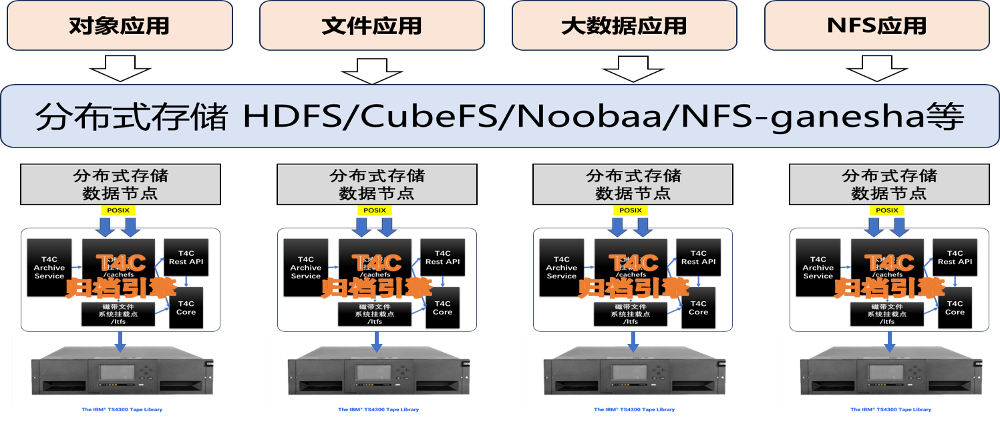

# 分布式存储和T4C归档集成
针对不同的分布式存储，T4C的集成架构相似，但是集成的步骤大相径庭。



## CubeFS分布式存储和T4C归档集成
[架构介绍](cubefs/cubefs_overview.md)```
[配置手册](cubefs/cubefs_steps.md)```
[Demo](cubefs/demo.md)```


## NFS ganesha存储和T4C归档集成


## HDFS分布式存储和T4C归档集成


## Noobaa分布式存储和T4C归档集成

